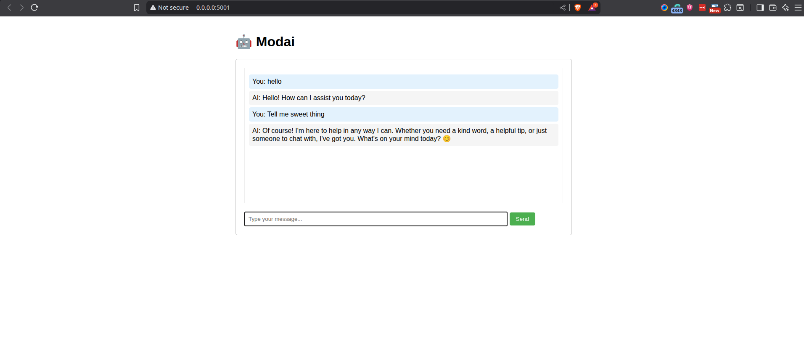

# modai-app

[](LICENSE)
[](https://www.python.org/)
[](https://www.docker.com/)
[](https://kubernetes.io/)

A Python-based chat application that provides a safe and moderated interaction

A Python-based chat application that provides a safe and moderated interaction with AI models through the Hugging Face API. The application includes built-in content moderation for both user inputs and AI responses, available both as a web interface and command-line tool.

## Features

- **Dual Interfaces**:
  - Web Interface: Modern, responsive chat interface accessible via browser
  - CLI: Interactive command-line chat interface
- **Content Moderation**:
  - Input moderation: Blocks prompts containing banned keywords
  - Output moderation: Automatically redacts potentially unsafe content in AI responses
  - Configurable banned keywords list
- **Safety First**: Built-in system prompt ensuring respectful and helpful AI responses
- **RESTful API**: HTTP endpoints for integration with other applications
- **Error Handling**: Robust error handling for API calls and content processing

## Demo



## Prerequisites

- Python 3.12+

- Docker and Docker Compose

- Minikube (for local Kubernetes deployment)

- Helm (for deploying to Kubernetes)

- `kubectl` (Kubernetes command-line tool)

- Hugging Face API token

## Setup (Local Development)

This section guides you through setting up and running the application locally using Docker Compose.

1.  **Clone the repository:**

    ```bash

    git clone https://github.com/daretechie/modai-app.git

    cd modai-app

    ```

2.  **Create a virtual environment and install dependencies (optional, for CLI usage/development):**

    ```bash

    python -m venv venv

    source venv/bin/activate  # On Windows: venv\Scripts\activate

    pip install -r requirements.txt

    ```

3.  **Create a `.env` file:**

    Create a file named `.env` in the project root and add your Hugging Face API token:

    ```

    HF_TOKEN=your_huggingface_token_here

    ```

    **Important**: Do NOT wrap the token value in quotes.

4.  **Run with Docker Compose:**

    Build and start the container. The `docker-compose.yml` file automatically loads your `.env` file and handles port mapping.

    ```bash

    docker compose up --build -d

    ```

5.  **Access the web interface:**

    Open your browser and navigate to:

    ```

    http://localhost:5001

    ```

## Usage

### Web Interface

Access the web interface at `http://localhost:5001` after running with Docker Compose. Use the chat interface to interact with the AI.

### Command Line Interface

If you've set up the virtual environment (Step 2 in Local Development), you can run the CLI chat application:

1.  **Start the CLI:**

    ```bash

    python app/moderated_chat.py

    ```

2.  Enter your messages when prompted with "You: "

3.  Type 'exit' or 'quit' to end the chat session.

## Deployment to Kubernetes (Minikube)

This section guides you through deploying the application to a local Kubernetes cluster using Minikube and Helm.

1.  **Prerequisites:**

    Ensure you have `minikube`, `helm`, and `kubectl` installed.

2.  **Start Minikube:**

    If your Minikube cluster is not running or is in a bad state, delete and restart it:

    ```bash

    minikube delete

    minikube start

    ```

3.  **Configure Docker environment for Minikube:**

    This makes `minikube`'s Docker daemon available to your terminal, so images you build are directly accessible by `minikube`. Run this in every new terminal session:

    ```bash

    eval $(minikube docker-env)

    ```

4.  **Build Docker image for Minikube:**

    Build your application's Docker image. It will be built directly inside `minikube`.

    ```bash

    docker build -t modai-app:latest .

    ```

5.  **Load Docker image into Minikube (Alternative to `eval $(minikube docker-env)`):**

    If you prefer not to use `eval $(minikube docker-env)`, you can build your image normally and then load it into Minikube:

    ```bash

    docker build -t modai-app:latest . # Build normally

    minikube image load modai-app:latest

    ```

6.  **Create HF_TOKEN Secret:**

    Your application requires the `HF_TOKEN`. Store it securely in a Kubernetes Secret:

    ```bash

    kubectl create secret generic hf-token-secret --from-literal=HF_TOKEN='your_huggingface_token_here'

    ```

    **Important:** Replace `your_huggingface_token_here` with your actual token.

7.  **Install or Upgrade Helm chart:**

    - **First-time installation:**

      ```bash

      helm install my-release helm/

      ```

    - **Upgrading an existing installation:**

      ```bash

      helm upgrade my-release helm/

      ```

8.  **Access the service:**

    To access your application, run `minikube tunnel` in a _separate terminal_ and leave it running. Then, in your original terminal, get the service URL:

    ```bash

    minikube service my-release-modai-app

    ```

    This will open the application in your default browser.

## REST API

The application provides a REST API endpoint for integration:

```bash

POST /api/chat

Content-Type: application/json


{

    "prompt": "Your message here"

}

```

Response format:

```json
{
  "response": "AI response here",

  "warning": "Content was moderated" // Optional, present if content was moderated
}
```

## Content Moderation

The application implements two-way content moderation:

1.  **Input Moderation**:

    - Checks user input for banned keywords

    - Blocks potentially harmful requests before they reach the AI

2.  **Output Moderation**:

    - Monitors AI responses for potentially unsafe content

    - Automatically redacts banned words with [REDACTED]

    - Provides warning messages for moderated content

## Project Structure

````

modai-app/

├── app/                      # Main Flask application package

│   ├── __init__.py           # Flask app instance and routes

│   ├── moderated_chat.py     # Core chat functionality and moderation logic

│   ├── static/               # Static web assets (CSS, JS)

│   │   ├── styles.css

│   │   └── chat.js

│   └── templates/            # Flask HTML templates

│       └── chat.html

├── helm/                     # Helm chart for Kubernetes deployment

│   ├── Chart.yaml

│   ├── values.yaml

│   ├── templates/

│   │   ├── deployment.yaml

│   │   ├── service.yaml

│   │   └── _helpers.tpl

│   └── ...

├── test/                     # Unit tests

│   └── test_app.py

├── .env.example              # Example environment variables

├── .dockerignore             # Files to ignore when building Docker images

├── .gitignore                # Files to ignore in Git

├── Dockerfile                # Docker build instructions

├── docker-compose.yml        # Docker Compose setup for local development

├── requirements.txt          # Python dependencies

└── README.md                 # Project overview and setup instructions


## Configuration

You can customize the application settings:

### Moderation Settings (`moderated_chat.py`):

- Modify the `BANNED_KEYWORDS` list to adjust moderation criteria
- Update the `SYSTEM_PROMPT` to change the AI's behavior
- Configure the model by updating the model name in the `query` function

### Web Interface Settings:

- Modify `static/styles.css` to customize the appearance
- Update port number when running Flask (e.g., `flask run --port 5001`)
- Configure Flask settings in `app.py`

## Error Handling

The application handles various error scenarios:

- API connection issues
- Invalid responses
- Token authentication errors
- Content moderation violations

## Testing

Automated tests are provided using [pytest](https://pytest.org/).

- Test files are located in the `test/` directory.
- To run all tests and see detailed output:
  ```bash
  pytest -v
````

- To run a specific test file:
  ```bash
  pytest -v test/test_app.py
  ```
- All tests should pass with output similar to:
  ```
  ============================= test session =============================
  test/test_app.py::test_home PASSED
  test/test_app.py::test_moderation_block PASSED
  ========================== 2 passed in 0.XXs ==========================
  ```
- To add new tests, create additional files in the `test/` directory and follow the pytest function naming convention (`test_...`).

## License

MIT License

## Contributing

Feel free to submit issues and enhancement requests!

1. Fork the repository
2. Create your feature branch
3. Commit your changes
4. Push to the branch
5. Create a Pull Request

## Load Docker Image into Minikube

After building the Docker image locally, load it into Minikube's internal registry:

```bash
# Load the Docker image into Minikube
minikube image load modai-app:latest

# Verify the image was loaded
minikube image ls | grep modai-app
```

This makes the image available to your Minikube cluster without needing to push to an external registry.
